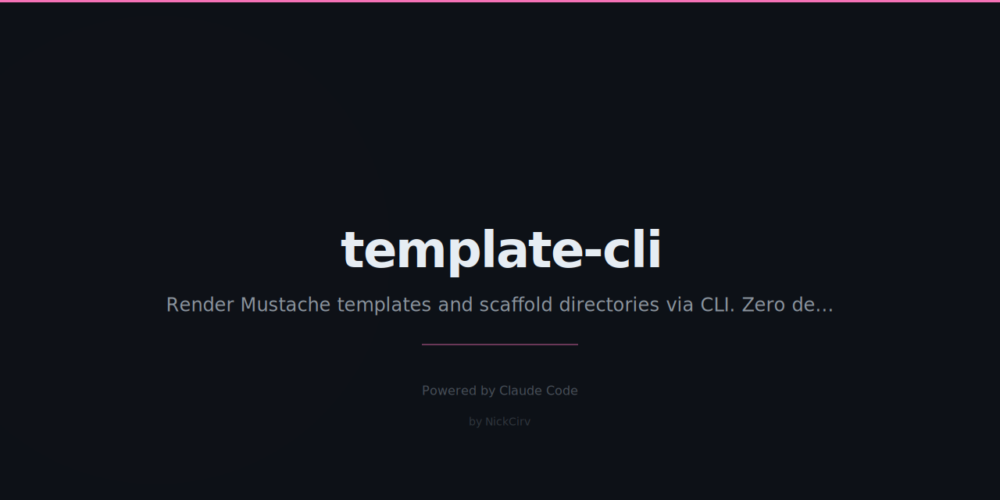

# template-cli

> Render Mustache-style templates from CLI. Files, directories, variables. Zero dependencies.

[](https://www.npmjs.com/package/template-cli)
[](https://nodejs.org)
[](LICENSE)

## Install

```bash
# Run without installing
npx template-cli render template.md --var name=Nick

# Or install globally
npm install -g template-cli
```

## Quick Start

```
# Render a single template to stdout
tmpl render template.md --var name=Nick --var project=MyApp

# Load variables from JSON
tmpl render template.md --vars data.json --output result.md

# Load variables from .env
tmpl render template.md --env --output result.md

# Scaffold an entire directory
tmpl scaffold ./templates --output ./my-project --vars config.json

# List templates and their required variables
tmpl list ./templates

# Validate template syntax
tmpl validate template.md
```

## Template Syntax

| Syntax | Description |
|--------|-------------|
| `{{name}}` | Variable interpolation (HTML-escaped) |
| `{{{raw}}}` | Raw output — no HTML escaping (great for code blocks) |
| `{{name \| upper}}` | Filter: `upper`, `lower`, `title`, `kebab`, `camel` |
| `{{#if condition}}...{{/if}}` | Conditional block (truthy check) |
| `{{#if condition}}...{{else}}...{{/if}}` | Conditional with else |
| `{{#each items}}{{this}}{{/each}}` | Loop over array |
| `{{> partial.md}}` | Include another template (relative path) |
| `{{! comment }}` | Stripped from output |

### Special loop variables

Inside `{{#each}}` blocks:

| Variable | Value |
|----------|-------|
| `{{this}}` | Current item (primitives) |
| `{{@index}}` | Zero-based index |
| `{{@first}}` | `true` for first item |
| `{{@last}}` | `true` for last item |
| `{{fieldName}}` | Object fields when items are objects |

### File name templates

In scaffold mode, file names can also be templates:

```
templates/
  {{name}}.service.js   →   MyApp.service.js
  {{name | kebab}}.md   →   my-app.md
```

## Options

| Flag | Description |
|------|-------------|
| `--var KEY=VALUE` | Inline variable (repeatable) |
| `--vars file.json` | Load variables from JSON file |
| `--env` | Load variables from `.env` in cwd |
| `--output`, `-o` | Write output to file or directory |
| `--missing-ok` | Leave unresolved `{{vars}}` as-is |
| `--strict` | Fail if any provided variable is unused |

Variable precedence (highest wins): `--var` > `--vars` > `--env`

## Examples

### Render with inline vars

```bash
tmpl render greeting.md --var name=Nick --var lang=English
```

`greeting.md`:
```
Hello, {{name}}!
Language: {{lang | upper}}
```

Output:
```
Hello, Nick!
Language: ENGLISH
```

### Load from JSON

`config.json`:
```json
{
  "project": "MyApp",
  "author": "Nick",
  "features": ["Auth", "API", "Dashboard"]
}
```

```bash
tmpl render readme-template.md --vars config.json --output README.md
```

### Conditionals and loops

```
{{#if premium}}
Premium features enabled.
{{else}}
Upgrade for premium features.
{{/if}}

Features:
{{#each features}}- {{this}}
{{/each}}
```

### Scaffold a project

```
templates/
  {{name}}/
    src/
      index.js
      {{name | camel}}.service.js
    package.json
    README.md
```

```bash
tmpl scaffold ./templates --output ./projects --vars '{"name":"my-app"}'
```

### Stdin piping

```bash
echo "Hello {{name}}!" | tmpl render - --var name=World
```

### Partials

```
{{> header.md}}

# Main content

{{> footer.md}}
```

## ASCII Demo

```
$ tmpl render app.md --var name=MyApp --var version=2.0

# MyApp

Version: 2.0

$ tmpl scaffold ./templates --output ./my-app --vars config.json
> Scaffolding ./templates -> ./my-app
v my-app/src/index.js
v my-app/src/myApp.service.js
v my-app/package.json
v my-app/README.md
v Done. 4 file(s) written to ./my-app

$ tmpl validate template.md
v template.md -- syntax valid

Required variables (3):
  {{name}}
  {{version}}
  {{features}}
```

## Security

- Zero external dependencies — no supply chain risk
- No shell execution — pure Node.js built-ins only (`fs`, `path`, `readline`)
- No `eval()` or dynamic code execution
- Variables are string-interpolated only

## License

MIT

---

Built with Node.js · Zero dependencies · MIT License
