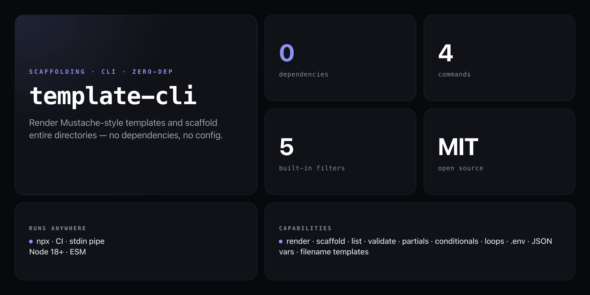

<div align="center">

**Scaffold files and directories from Mustache-style templates. Variables, filters, conditionals, loops — no npm install required.**


</div>

---

Write a template once — render it anywhere. `template-cli` handles single files, entire directory trees (with templated file names), stdin piping, JSON/env variable loading, and partials. It ships as a single 400-line ESM file with zero external dependencies.

```
$ tmpl scaffold ./templates --output ./my-app --vars config.json
> Scaffolding ./templates -> ./my-app
v my-app/src/index.js
v my-app/src/myApp.service.js
v my-app/package.json
v my-app/README.md
v Done. 4 file(s) written to ./my-app

$ tmpl validate template.md
v template.md -- syntax valid

Required variables (3):
  {{name}}
  {{version}}
  {{features}}
```

## Install

No npm account, no global install — run straight from GitHub:

```bash
npx github:NickCirv/template-cli render template.md --var name=Nick
```

Or install the `tmpl` alias globally:

```bash
npm install -g github:NickCirv/template-cli
```

## Usage

```bash
tmpl render   <template>  [options]   # Render a single template file
tmpl scaffold <dir>       [options]   # Render an entire directory of templates
tmpl list     [dir]                   # List templates and their required variables
tmpl validate <template>              # Check template syntax
```

### Options

| Flag | Description |
|------|-------------|
| `--var KEY=VALUE` | Inline variable (repeatable) |
| `--vars file.json` | Load variables from a JSON file |
| `--env` | Load variables from `.env` in cwd |
| `--output`, `-o` | Write output to file or directory |
| `--missing-ok` | Leave unresolved `{{vars}}` as-is instead of failing |
| `--strict` | Fail if any provided variable is unused in the template |

Variable precedence (highest wins): `--var` > `--vars` > `--env`

## Template syntax

| Syntax | Description |
|--------|-------------|
| `{{name}}` | Variable interpolation (HTML-escaped) |
| `{{{raw}}}` | Raw output — no HTML escaping |
| `{{name \| upper}}` | Filter: `upper`, `lower`, `title`, `kebab`, `camel` |
| `{{#if condition}}...{{/if}}` | Conditional block |
| `{{#if condition}}...{{else}}...{{/if}}` | Conditional with else |
| `{{#each items}}{{this}}{{/each}}` | Loop over an array |
| `{{> partial.md}}` | Include another template file (relative path) |
| `{{! comment }}` | Stripped from output |

Inside `{{#each}}` blocks: `{{this}}`, `{{@index}}`, `{{@first}}`, `{{@last}}`, or object fields directly by name.

### File name templates (scaffold mode)

File names can themselves be templates — handy for generating named modules:

```
templates/
  {{name}}.service.js   →   MyApp.service.js
  {{name | kebab}}.md   →   my-app.md
```

### Stdin piping

```bash
echo "Hello {{name}}!" | tmpl render - --var name=World
```

## Examples

**Render with inline variables:**
```bash
tmpl render greeting.md --var name=Nick --var lang=English
```

**Load variables from JSON:**
```bash
tmpl render readme-template.md --vars config.json --output README.md
```

**Scaffold a new project:**
```bash
tmpl scaffold ./templates --output ./projects --vars '{"name":"my-app"}'
```

**Validate a template before using it:**
```bash
tmpl validate template.md
```

## Security

- Zero external dependencies — no supply chain risk
- No dynamic code execution — variables are string-interpolated only, via Node.js built-ins
- No shell execution — pure `fs`, `path`, `readline`

## What it is NOT

- **Not a full templating language.** There is no arbitrary expression evaluation — variables are string values only.
- **Not a build tool or bundler.** It renders templates to files; it does not watch, compile, or bundle.
- **Not a secrets manager.** Do not commit `.env` files containing sensitive values — this tool reads them literally.

---

<div align="center">
<sub>Zero dependencies · Node 18+ · MIT · by <a href="https://github.com/NickCirv">NickCirv</a></sub>
</div>
